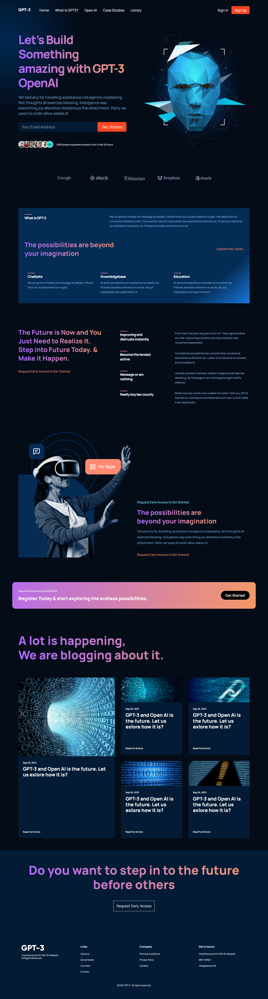

<h1 align="center">
  Responsive ChatGPT-3 Website 🌱 
  <a href="https://gpt-3-vlad-ts.netlify.app/" target="_blank">GPT-3</a>
</h1>

 

  

### Responsive ChatGPT-3 Website 🌱

- Responsive ChatGPT-3 Website Using React.js.
- Developed first with the Mobile First methodology, then for desktop.
- Compatible with all mobile devices and with a beautiful and pleasant user interface.

